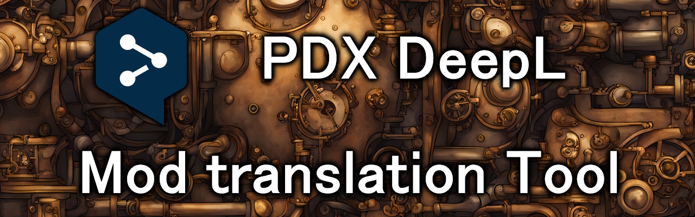

# Overview
**pdx-deepl** is a tool to do incremental auto translation of mods for Paradox games using DeepL.



## Contents
* [How does it work?](#how-does-it-work)
* [Manual and Machine translation](#manual-and-machine-translation)
* [Supported Games](#supported-games)
* [Configuration](#configuration)
    * [Glossaries](#glossaries)
* [Getting DeepL API access](#getting-deepl-api-access)
* [Usage](#usage)
* [Issues with free DeepL API](#issues-with-free-deepl-api)
* [How To Build](#how-to-build)

## Status
[](https://github.com/kaiser-chris/pdx-deepl/actions/workflows/build.yaml)
[](https://github.com/kaiser-chris/pdx-deepl/releases)

## How does it work?
The tool will use a base language and check whether a localization key
from the base language is either missing or outdated in other languages.
If a key is missing or outdated, it will translate the base language localization
and add the translation to the same file for another language.
Also, the translation is marked with a checksum of the base language key so that in
a second run pdx-deepl can check whether a key was updated.

## Manual and Machine translation
Localizations that are generated by pdx-deepl will have a comment like this at the end:
```yaml
 je_obj_magic_academy: "Magische Akademie bauen" #deepl:3993713733
```
This marks them as machine translated and pdx-deepl will update them when necessary.

All localizations without this comment at the end will be treated as manually translated
and are not touched by pdx-deepl.

In this example the localization `objective_magic_dominance_idle_header` is assumed to be
manually translated and will therefore be ignored by pdx-deepl.
```yaml
 je_obj_magic_academy: "Magische Akademie bauen" #deepl:3993713733
 objective_magic_dominance_idle_header: "Setzen Sie Ihren Weg fort"
```

The system allows translators to touch up specific localizations which are
then preserved in further handling.

## Supported Games
- Victoria 3
- Crusader Kings 3
- Others may work but are untested

## Configuration
pdx-deepl translation can be configured with the [translation-config.json](translation-config.json).
In this file, you can define which language should be used as a base for translations and also
which languages should be generated.

In this example the `english` localization will be treated as the source of truth, and pdx-deepl
will generate translations for `german` and `french` without glossaries.
```json
{
  "base-language": "english",
  "target-languages": [
    {
      "name": "german"
    },
    {
      "name": "french"
    }
  ]
}
```

### Glossaries
> **NOTE:** Local glossaries are not supported!

Glossaries can be referenced using their id in the config file:
```json
{
  "base-language": "english",
  "target-languages": [
    {
      "name": "german",
      "glossary": "your-glossary-id"
    }
  ]
}
```

How to use the DeepL API to create and manage glossaries is documented here:
- https://developers.deepl.com/docs/api-reference/glossaries

## Getting DeepL API access
DeepL offers free and pro plans for translations.
For trying out the tool, I recommend starting with a free account.
But if your mod is big, it may make sense to look into the pro-plan.

### DeepL Documentation
- https://www.deepl.com/en/translator
- https://support.deepl.com/hc/en-us/articles/360019358899-Accessing-DeepL-s-API
- https://support.deepl.com/hc/en-us/articles/360020695820-API-Key-for-DeepL-s-API

## Usage
First download the latest release from the Releases page of the repository:
- https://github.com/kaiser-chris/pdx-deepl/releases

Then you can run the application like this:
```
.\pdx-deepl.exe --localization="X:\path\to\localization\directory" --api-token="your token"
```

All start commands can be found in the help dialog. Help dialog (`.\pdx-deepl.exe -h`):
```
Usage of pdx-deepl:
  -api-token string
    	Required: Deepl API Token
  -api-type string
    	Optional: Whether to use free or paid Deepl API (default "free")
  -config string
    	Optional: Path to translation config file (default "translation-config.json")
  -localization string
    	Optional: Path to localization directory of your mod (default ".")
```

## Issues with free DeepL API
The current version has issues when it is used with the **free** DeepL API:
- You will get "too many requests" errors, and those are from rate limiting by the DeepL API. The free api has lower priority than the paid one
- The current implementation skips further loc keys in the same file when it encounters the issue. Since the whole thing is incremental, you have to rerun the application to generate more keys. For my `german` translation, I had to run it quite a lot of times, but I got it done in the end.
- There IS a monthly character limit of 500k for the free API, which may be an issue when translating a big mod. But running it on another developer's PC with a different account should enable generating more translations
- I recommend starting with one language instead of multiple

## How To Build
First download and install the Go SDK:
- https://go.dev/doc/install

Next open the project folder in a terminal (e.g. cmd) and run the following command:
```
go build
```

That is it. There should be an executable in the project folder now.